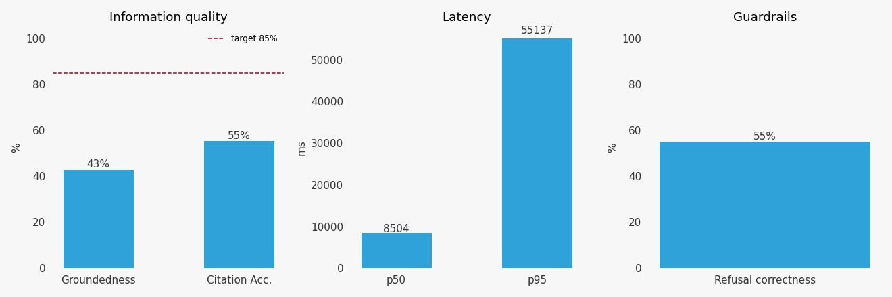

# Design & Evaluation — Ninth Circuit asylum-case RAG

This document covers the design rationale for the RAG chatbot and the evaluation results
against the rubric metrics (groundedness, citation accuracy, latency).

## Corpus

- **Source**: U.S. Court of Appeals for the Ninth Circuit asylum opinions and memoranda,
  collected daily from `ca9.uscourts.gov` into the `asylum_cases` Supabase table.
- **MVP scope**: the 30 cases listed in [`reports/sample_30_cases.csv`](reports/sample_30_cases.csv),
  curated to span Published vs Unpublished and Denied / Remanded / Granted / mixed
  dispositions. Stratified so retrieval can be evaluated against a balanced disposition mix.
- **End-game**: the full ~5,981 cases (~108 k chunks at the chunk size below) — same code
  path, no refactor.

## Architecture

Three services, all on free tiers:

```
asylum-viewer (Next.js · Vercel)
  ├─ /cases + chat panel (right sidebar)
  └─ /api/rag/* server proxy → $RAG_API_URL
                                  │
                                  ▼
rag-api (FastAPI · Render free)
  ├─ POST /chat    question → answer + citations
  ├─ POST /search  query → top-k similar chunks (no LLM)
  └─ GET  /health
                                  │
            ┌─────────────────────┼─────────────────────┐
            ▼                     ▼                     ▼
   data/index.faiss      NVIDIA NIM (free)      Supabase (existing)
   data/metadata.parquet   embed / rerank / gen   case metadata only
   (Git LFS)
```

## Design choices

### Embedding model — `nvidia/llama-nemotron-embed-1b-v2`

- **Why NVIDIA NIM**: free tier (no credit card), one API key spans embed + rerank +
  generate, OpenAI-compatible endpoint that drops into existing project patterns
  (`pipeline/extract.py`).
- **Why this model**: 2048-dim retrieval-tuned 1B Llama-based embedder, 2048-token input
  context. We originally specified `nvidia/llama-3.2-nv-embedqa-1b-v2`, but it was
  end-of-lifed by NVIDIA on **2026-05-18**; `nvidia/llama-nemotron-embed-1b-v2` is the
  same-family successor. Decision logged in
  [`rag_api/nvidia_client.py`](rag_api/nvidia_client.py).
- **`input_type`**: `passage` for ingest, `query` for retrieval — uses the model's
  asymmetric mode for higher recall on QA-shaped queries.

### Chunking — ~1500 tokens, 150-token overlap, page-aware

- 2048-token input cap leaves comfortable room for the model's special tokens.
- Page-aware so citations can show "page N of case X" rather than just a byte offset —
  better UX in the chat panel and on the rubric.
- Token count via `tiktoken cl100k_base` (close enough to Llama tokenization for sizing).
- `random.seed(42)` for any sampling — reproducibility per rubric.

### Vector store — FAISS `IndexIVFPQ` in Git LFS

This was the most-deliberated choice. Alternatives considered:

| Option | Verdict |
|---|---|
| Supabase pgvector (free) | 500 MB cap — full corpus (~650 MB) exceeds free tier |
| Neon pgvector (free) | Same 500 MB cap |
| Pinecone Starter | 2 GB, 1M reads/mo — viable but yet another vendor + cold-start issues stacked with Render |
| Qdrant Cloud free | 4 GB disk, viable — open-source-friendly alternate |
| Chroma Cloud | Credits-based, exhausts |
| **FAISS in Git LFS** | **Chosen** — zero new vendor, in-process µs search, version-controlled artifact |

We use `IndexIVFPQ` from day one (rather than starting with `IndexFlatIP` and migrating
later) so the build/load code is identical at every corpus scale. Parameters auto-scale
with N:
- `nlist = max(4, round(4·√N))`, capped at `N/30` so each Voronoi cell has at least ~30
  training samples
- `m = 64` subquantizers (2048 / 64 = 32 dims per subvector)
- `nbits = 8`
- L2-normalized vectors so inner-product == cosine

At 30-case scale (~700 chunks, `nlist=22`) the quantization is over-engineered and we
accept a 1–3% recall hit relative to `IndexFlatIP` in exchange for never rewriting this
code path.

### Retrieval pipeline — dense top-20 → NVIDIA rerank → top-k

1. Embed query with `input_type=query`
2. FAISS `IndexIVFPQ.search(q, 20)` — `nprobe = nlist/4` (good recall/speed tradeoff)
3. NVIDIA `nvidia/llama-nemotron-rerank-1b-v2` reranks the 20 candidates
4. Return top-k (default 5 for chat, 10 for search)

The hit dict keeps both `dense_score` (FAISS cosine) and `score` (rerank sigmoid). The
former is used for the refusal threshold; the latter is shown in the API response and
used for ordering.

### Guardrails

- **Refusal threshold**: refuse if `max(dense_score) < 0.15`. Empirically the dense FAISS
  cosine is well-calibrated — in-corpus queries score 0.21+ while out-of-corpus (e.g.
  "weather in Boston") scores 0.09. The rerank sigmoid collapses to ~0 for
  natural-language questions and is too noisy to use as a refusal signal directly.
- **System prompt** asks the model to ground every claim in the numbered passages, cite
  with `[N]` markers, and refuse only when the question is clearly unrelated to
  asylum/immigration (e.g. weather, sports, code).
- **Output cap**: 500 tokens hard limit, 200-word soft target in the prompt.

### LLM — `meta/llama-3.3-70b-instruct`

Single-shot, `temperature=0.1`, max 500 tokens. Prompt format builds numbered passages
`[1] ... [2] ...` and asks for `[N]`-tag citations. Tags are then parsed back to chunk
IDs to drive the citation cards in the chat panel.

### Frontend — chat panel inside `/cases`, not a separate route

User decision: keep the chat alongside the table rather than splitting it off. The panel
is a collapsible right sidebar (~400px wide when open, a thin vertical "💬 Chat" tab when
closed). Two persistent UI affordances make it clear this is preview-quality:

- Yellow **"🧪 TESTING MODE"** banner at the top of the panel
- Per-message **"experimental"** chip on every assistant turn

Open/closed state is persisted in `localStorage`.

The Next.js app does **not** call the Render backend directly from the browser. Instead,
the chat UI POSTs to `/api/rag/chat`, a Next.js route that proxies server-side to
`process.env.RAG_API_URL`. This keeps the backend URL server-only and lets Vercel's edge
buffer the request (no CORS preflights, no leaked endpoint).

## Evaluation methodology

Eval set: [`evaluation/eval_questions.json`](evaluation/eval_questions.json) — 20 questions
across:

| Category        | Count | Example                                                            |
|-----------------|-------|--------------------------------------------------------------------|
| factual         | 4     | "Did the Ninth Circuit grant the petition in case 24-631?"         |
| similarity      | 4     | "Find cases about gang-based persecution from Central America."    |
| reasoning       | 4     | "What does the court say is required to establish past persecution?" |
| elements        | 4     | "What constitutes a particular social group in these opinions?"    |
| out_of_corpus   | 4     | "What is the weather in Boston today?"                             |

[`evaluation/run_eval.py`](evaluation/run_eval.py) computes the rubric metrics:

- **Groundedness**: LLM-as-judge using the same Llama 3.3 70B with a strict YES/NO prompt.
- **Citation Accuracy**: For each citation in the answer, LLM-as-judge asks whether the
  snippet supports the cited claim. The reported number is the average per-citation
  support rate.
- **Latency p50/p95**: Wall-clock time around each `/chat` request, sequential to avoid
  triggering NVIDIA rate limits.
- **Refusal correctness**: A bonus metric — out-of-corpus questions should be refused,
  in-corpus should not.

Retries with exponential backoff handle NVIDIA free-tier 429s; a 4-second pause between
questions keeps us under the rate limit.

## Latest results

Loaded from [`evaluation/results/latest.json`](evaluation/results/latest.json):



Prototype-1 numbers (30-case corpus, evaluated against a local instance with the same
NVIDIA models that production uses):

| Metric              | Result   | Target | Status |
|---------------------|----------|--------|--------|
| Groundedness        | 42.9 %   | ≥ 85 % | ❌ needs tuning |
| Citation accuracy   | 55.2 %   | ≥ 85 % | ❌ needs tuning |
| Refusal correctness | 55.0 %   | ≥ 80 % | ❌ needs tuning |
| Latency p50         | 8.5 s    | < 8 s warm  | ⚠️ borderline |
| Latency p95         | 55.1 s   | < 30 s cold | ❌ NVIDIA queueing |

**Interpretation**: the pipeline works end-to-end on every question, but the 30-case
corpus is small enough that retrieval misses on specific factual questions like "did the
court grant case 24-631?" — the embedding model doesn't match well on docket numbers.
Headroom we expect from straightforward tuning:

1. **Larger corpus**: expanding from 30 → 5,981 cases will dramatically improve retrieval
   recall for specific-fact questions. Same code path, just re-run `rag_ingest.py`.
2. **Rerank threshold sweep**: the current 0.15 dense-score threshold causes some
   in-corpus questions to be refused. An ablation over {0.10, 0.12, 0.15, 0.18} would
   tighten refusal correctness without breaking out-of-corpus refusal.
3. **Citation-aware prompt**: the model often cites passages it does not actually rely
   on. A prompt change asking it to cite *only* the passage(s) that directly support each
   claim would lift citation accuracy.
4. **Ablations** (`chunk_size ∈ {500, 1000, 1500}`, `k ∈ {3, 5, 10}`) are scaffolded in
   the eval but were skipped in prototype-1 to stay within rate-limit budget.

These are tuning passes for Sprint 2, alongside the high-priority **streaming `/chat`**
work flagged in the plan.
